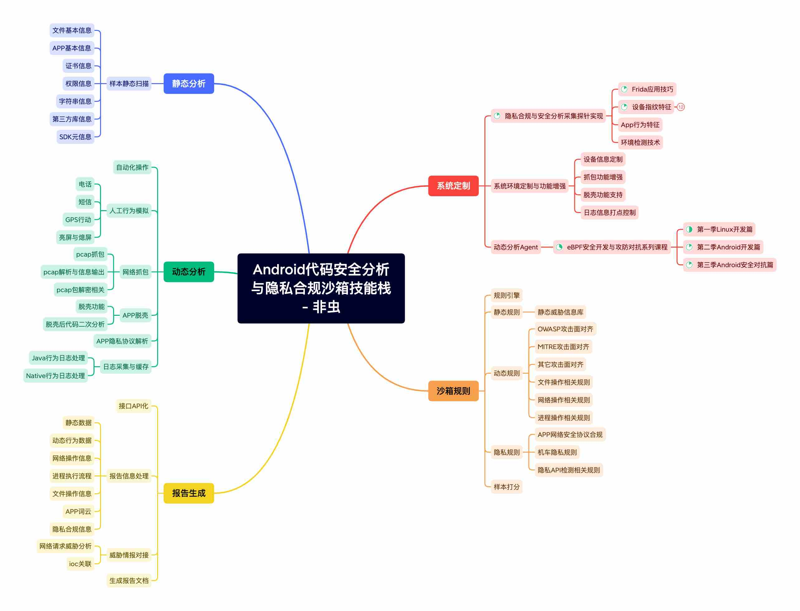

## Android代码安全分析与隐私合规沙箱技能栈

 
技能栈脑图

下图是安卓沙箱技术栈宇宙，目前正围绕该技术栈开发教学课程。

目前，正在完善的课程有：

- **eBPF安全开发与攻防对抗系列课程**

- **App隐私合规与安全分析探针实战课程**

见下图，**打上绿色小勾的，表示已经务课好了的，具体发布的以实际为准**。

---

## eBPF安全开发与攻防对抗系列课程

eBPF系列课程尽可能全面的探索eBPF功能与特性。

 
 
eBPF课程简介

 
### eBPF课程简介

本课程由简到难，循序渐进，目前设定正式课程共三季内容，84节课程内容，课程根据难度，每集时长约**15**分钟到**120**分钟不等。

课程分为Linux eBPF开发篇，安卓eBPF开发篇，安卓安全对抗篇。具体参见下面课程大纲的思维导图。

本课将带领学员重点学习Linux平台上的eBPF软件开发技术，安卓平台上的eBPF开发与安全对抗。

包含不限于：

- 1. eBPF功能特性
- 2. eBPF MAP数据结构
- 3. eBPF内核helpers方法的使用
- 4. eBPF的程序类型
- 5. bcc/bpftrace/libbpf的API接口与实例
- 6. eBPF功能实战

 
 
eBPF特性与课程索引对应表

 
### eBPF特性与课程索引对应表

[点击查看完整eBPF特性与课程索引对应表](./eBPF特性与课程索引对应表.md)

 
 
eBPF课程目标

### eBPF课程目标

完成本课的学习后，您将具备以下能力：

- Linux平台eBPF工具的技术原理与开发能力
- Linux平台上eBPF恶意软件分析能力
- 安卓内核的修改与定制能力
- 安卓平台抓包软件开发
- 自己动手完成eBPF的安全分析环境构建
- 使用eBPF完成安卓App hook
- 使用eBPF完成沙箱环境改机安全对抗

### eBPF课程目录

 
 
eBPF课程试看

### eBPF课程试看

[环境搭建](https://mp.weixin.qq.com/s/wGAwcg8VnB4PLREzdNPWng)

eBPF程序类型之Socket过滤器

 
 
eBPF课程答疑

### eBPF课程答疑

1、授课方式，更新进度，多久可以学完?

课程采用录播授课，每位学员单独的本地学习环境。为保证课程质量，更新频率初步定为一周两节，大型节假日每周多更新一到两节。承诺所有课程200天内全部完成。更新完课程后，学员可以继续学习，直到学会为止。

2、我需要准备什么学习环境与设备吗?

课程会提供Ubuntu20.04与Ubuntu22.04的虚拟机镜像，供学员快速搭建开箱即用的学习环境。

学习环境需要**一台Windows操作系统电脑**，课程实验环境可以选择安装Ubuntu22.04系统的虚拟机，或者另外准备好一台安装好Ubuntu22.04系统的电脑也可。

对于第二季与第三季的学员，课程会安卓eBPF的学习环境的镜像环境。可以选择**ARM64开发板/树霉派/电视盒子/ARM云主机**等环境安装部署。。如果你手上有安卓设备（Pixel 6）或以上设备在手，也可以作为学习辅助设备。

3、学习需要什么必备的编程基础与知识储备?

学习课程中的内容，需要使用到C、Python、Golang等编程语言，课程基本不涉及C++语言。

课程中大量使用C语言来实现课程内容中讲解的功能。学员需要对C语言熟悉。课程涉及到的Python与Golang语言的内容，不熟悉可以使用C语言版本的程序代替，但掌握这两门语言可以让您学习更加轻松。

除此外，学员还需要对Linux/安卓的软件基本开发流程熟悉，对Linux内核有基本的认识。这些知识课程中也有提供参考资料指导。

4. 我主要学手机端，这个课程需要单独买个学习手机不？

课程提供了虚拟机与模拟器环境，全部代码测试保证可以运行的安卓内核环境为5.10版本。安卓5.4的内核需要编译修改内核来支持代码运行，不保证所有代码可以低版本内核运行。如果不想购买开发板或新版本手机，可以在模拟器环境中学习。

---

## App隐私合规与安全分析探针实战课程

### 课程目录

 
 
课程试看

### 课程试看

课程目录目前设计了第一与第二两季。**后续可能的第三与第四季的计划，可以见下面视频介绍第7分钟处！**

 
 
课程受众人员

 
### 课程受众人员

- 隐私合规从业人员
- App逆向分析人员
- 安全沙箱开发人员
- 安全爱好者
- 爬虫与反爬相关从业人员
- 业务风控从业人员

 
 
课程目标

### 课程目标

完成本课的学习后，您将具备以下能力：

- Frida一些高级功能的使用
- 使用Frida快速调试API的技巧
- 网络安全相关的法律法规
- 安卓设备指纹API接口的认识
- 安卓设备指纹API接口数据的获取
- 自己动手打造隐私合规数据采集工具
- 不同版本中敏感API差异
- 安卓敏感行为的分析

---
 
## 购买课程

**目前开学季课程活，限直接联系本人微信feicongcn购买的学员，课程的播放需要微信绑定设备授权与签署保密协议**
 
### 课程目前价格
 
eBPF课程第一季Linux eBPF开发篇价格**1268**元。

**eBPF课程全季（含第1、2、3、4季）价格3799元**。

App隐私合规与安全分析探针实战课程全季（含第1、2、3季），价格**1899元**

App探针实战课程第一季已完结。

eBPF系列课程第一、二季已完结。

### 课程打包购买

**eBPF全套视频3799元，618活动价格3399。两人团购价每人3099元。再送328元知识星球与1899元隐私探针全套视频**

**隐私探针全套视频1899元，618活动价格899。两人团购价每人699元。再送328元知识星球**

eBPF课程全季（含第1、2、3、4季）加上配置好环境的开箱即用学习设备（价值1665元的开发板orangepi 5plus 16g+512g ssd+原装电源+外壳风扇+wifi6网卡），加上App隐私合规与安全分析探针实战全季课程，价值**3799+1899+1665**元，现活动价格**4999**元。

eBPF课程全季（含第1、2、3、4季）加上配置好环境的开箱即用学习设备（价值1765元的开发板nanopc t6 16g+512g ssd+原装电源+原装外壳+wifi6网卡），加上App隐私合规与安全分析探针实战全季课程，价值**3799+1899+1765**元，现活动价格**5099**元。

eBPF课程全季（含第1、2、3、4季）加上配置好环境的开箱即用学习设备（价值1965元的开发板rock5b 16g+512g ssd+pw65w电源+外壳风扇+wifi6网卡），加上App隐私合规与安全分析探针实战课程全季课程，价值**3799+1899+1965**元，现活动价格**5399**元。

eBPF课程全季（含第1、2、3、4季）加上全新8核16G硬盘512gssd的迷你电脑ser5pro一台，已经配置好Linux与安卓eBPF开发环境，也可作为课程观看设备，开箱即用！加上App隐私合规与安全分析探针实战全季课程，价值**3799+1899+2299**元，现活动价格**5499**元。

## 说明

eBPF系列课程目前公开目录为3季内容。第4季计划制作中，内容为eBPF其它在新版本内核中所有涉及到的特性。目录不对外公开。

隐私探针系列课程目前公开目录为2季内容。第3季计划制作中，内容为之前介绍视频公开中的内容。

注意：

视频课程由于性质原因，代码与课程一旦发放，不支持任何理由的退款，购买前请知晓！

所有签署保密协议的eBPF学员，可学完前3季后，免费观看第4季（第4季发布完成后授权观看），没有所有签署保密协议的朋友需要签署后才可以观看，否则视为放弃福利。

## 关注微信公众号

 
 
关注微信公众号

